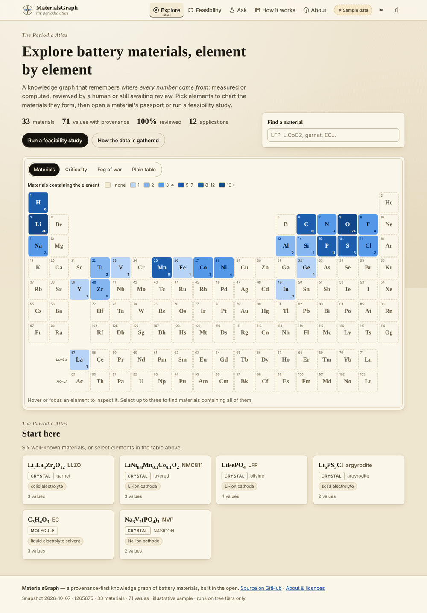
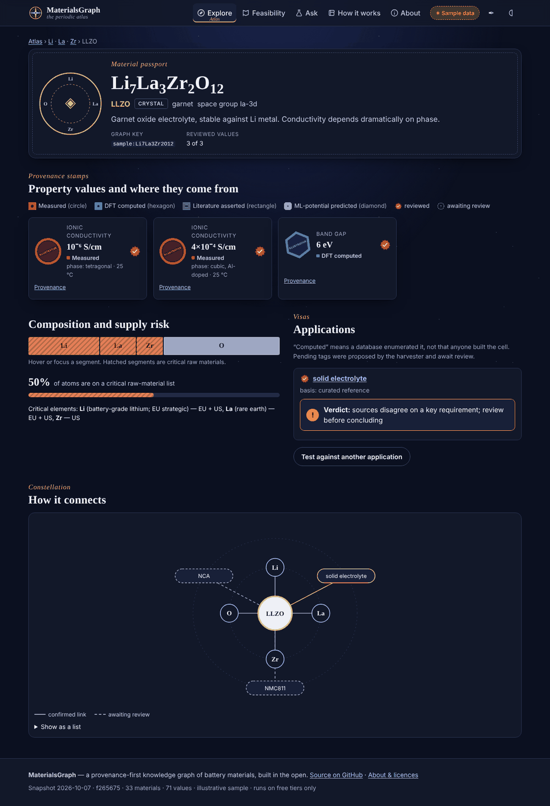
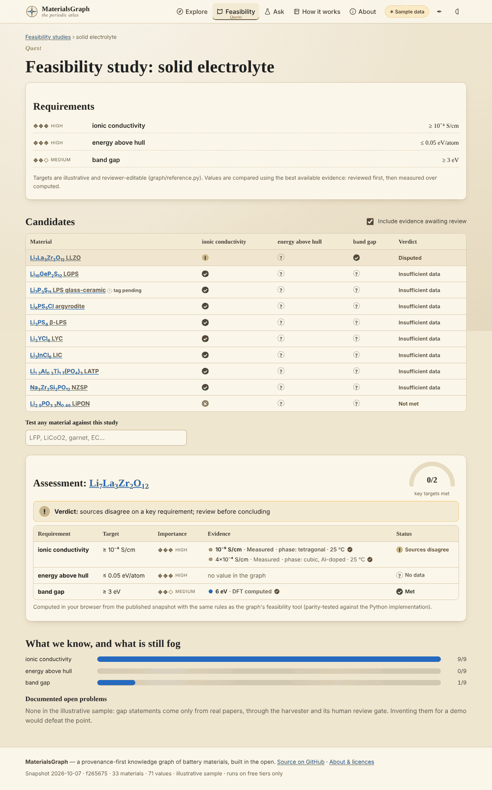

# MaterialsGraph

A personal knowledge graph over battery-materials data: Materials Project and OPTIMADE computed properties, measured solid-electrolyte conductivities, electrolyte molecules, and literature-derived application tags, property values and open-problem ("gap") statements — every value with provenance, every AI-derived edge behind a human review gate — queryable in natural language through a GraphRAG agent.

Read `docs/technical_buildplan.md` first (schema, provenance semantics, harvester, query layer). `docs/strategy.md` is the committed scope; `docs/harvester_graphrag_plan.md` is the feasibility assessment and phase plan behind the current code.

## Setup

```bash
cp .env.example .env            # fill NEO4J_PASSWORD, MP_API_KEY, OPENALEX_MAILTO; LM_STUDIO_MODEL
pip install -e ".[dev,fulltext]"
docker compose up -d            # Neo4j 5.26 Community on bolt://localhost:7687
mg schema apply                 # constraints, indexes, reference data, periodic table
```

LM Studio must be serving an OpenAI-compatible endpoint (default `http://localhost:1234/v1`) for extraction and for `mg ask`. The Claude API is used only by `mg harvest validate --cloud`.

## Pipeline

```bash
# Tier 1: structured, deterministic (no LLM)
mg ingest mp --ions Li,Na                 # data/raw/battery_electrodes_<ion>.json
mg ingest optimade --provider oqmd        # data/raw/optimade_oqmd.json
mg ingest liverpool                       # measured Li conductivities (checks the repo licence)
mg ingest molecules                       # electrolyte molecules via PubChem (--offline uses the alias table)
mg load --mp --optimade oqmd --liverpool --molecules

# Tier 2: literature harvester (local LLM) with a human review gate
mg harvest discover --keywords "halide solid electrolyte,argyrodite conductivity" --since 2023 --limit 50
mg harvest fulltext --batch <id>          # CC-licensed open-access PDFs only -> Chunks
mg harvest extract  --batch <id>          # LM Studio -> candidates (materials, values, USED_IN, gaps)
mg harvest validate --batch <id> [--cloud]
mg harvest review   --batch <id>          # a / r / e / s / q  -- nothing AI-derived is confirmed without this
mg harvest commit   --batch <id> [--include-pending]
mg harvest stats
mg embed --chunks                         # 384-d sentence-transformers vectors for retrieval
mg similar                                # composition-cosine SIMILAR_TO, confirmed=false

# GraphRAG
mg ask "stable Li cathodes without Co with capacity above 150 mAh/g"
mg ask "is Li7La3Zr2O12 feasible as a solid electrolyte" --show-cypher
mg ask "critical-element exposure of LiNi0.8Co0.1Mn0.1O2"
mg ask "what does recent literature say about halide electrolytes" --use-case literature
mg ask "what data is missing for solid electrolytes" --use-case gaps
```

`mg harvest run --keywords ... --fulltext` chains discover -> fulltext -> extract -> validate -> stage in one go.

## Use cases the query layer serves

| Use case | Question shape | What comes back |
|---|---|---|
| screening (materials identification) | "find stable X without Co with capacity > 150" | ranked candidates, each value with source type, confirmed flag and source id |
| feasibility study | "is LLZO feasible as a solid electrolyte?" | each requirement target met / unmet / missing / conflicting, deterministic verdict, supporting sources, related gaps |
| composition / molecular analysis | "critical-element exposure of NMC811", "what is LiTFSI" | element fractions with EU/USGS criticality flags, substitutions, similar materials; molecule identity and roles |
| literature | "what does recent work say about halide electrolytes" | hybrid vector + full-text retrieval expanded into the values/tags/gaps those papers support |
| gaps / coverage | "what is missing for solid electrolytes" | coverage per required property plus documented open problems |
| freeform | anything else | LLM-written Cypher, validated read-only, bounded, EXPLAINed |

## Hard rules (see CLAUDE.md)

- All graph writes go through `src/materialsgraph/graph/writers.py`; every MERGE key is a constraint in `schema.cypher`.
- LLM-derived `USED_IN`, `PropertyValue`, `SIMILAR_TO`, `Gap` are written `confirmed=false` until a human accepts them in `mg harvest review`.
- No general web crawling and no paywalled full text; only CC-licensed PDFs are chunked. No NEOS/Marazzi-derived data.

## The Periodic Atlas (showcase website)

`web/` is a Vite + TypeScript + Preact site that makes the graph explorable: a periodic table with material, criticality and data-coverage overlays; a "passport" per material with provenance stamps and review seals; feasibility studies with requirement checklists, leaderboards and verdicts; a question console; and a scroll-through of the harvester pipeline.



| Material passport (dark) | Feasibility study |
|---|---|
|  |  |

Design rules the site follows:

- **It never depends on the backend.** Every page runs from `web/public/data/snapshot.json`. The live API only adds free-text questions; the guided builder falls back to a TypeScript port of the deterministic tools, parity-tested against the Python ones on shared fixtures.
- **Provenance is always visible.** Stamp shape encodes source type (circle measured, hexagon DFT, rectangle literature, diamond ML-potential), a wax seal means reviewed, a dashed outline means awaiting review.
- **Fantasy never replaces meaning.** Each fantasy term sits next to its plain term, and a Plain mode removes the flavour entirely.
- **Accessible.** Keyboard-navigable periodic table grid, text on every colour cue, validated colour-blind-safe palette, WCAG 2.2 AA axe scans in both themes on desktop and phone.

```bash
cd web
npm install
npm run dev            # http://localhost:5173/Materialsgraph/
npm test               # Vitest: engine parity, snapshot schema, formatting, router
npm run build          # type-check + build + performance budget
npx playwright test    # every route, desktop + phone, light + dark, axe scan, mocked API states
```

The shipped snapshot is an **illustrative sample**: rounded, commonly reported values for ~30 well-known materials, all citing one non-citable source, with no invented DOIs or database ids. A "Sample data" badge says so on every page. Replace it with your graph:

```bash
mg export site                      # Neo4j -> web/public/data/snapshot.json (no abstracts, chunks or embeddings)
mg site build-sample                # regenerate the illustrative sample instead
```

## Deploying for free

Everything runs on free tiers with no card on file, so the bill is always zero. Limits change; check each console.

| Piece | Service | Free-tier notes |
|---|---|---|
| Website | GitHub Pages | public repo; deployed by `.github/workflows/pages.yml` |
| API | Vercel Hobby (Python function) | non-commercial use; slim bundle (~120 MB, no torch/pymatgen) |
| Graph | Neo4j AuraDB Free | small node/relationship caps; pauses after a few days idle (daily keep-alive workflow) |
| Language model | Groq free tier, OpenRouter `:free` as fallback | tokens per minute are the real limit; the API keeps a daily budget below it |

1. **Pages.** Settings → Pages → Source = GitHub Actions. Push to `main`; the site appears at `https://<user>.github.io/Materialsgraph/` in static mode.
2. **AuraDB Free.** Create a free instance and note its URI and password. Seed it with the sample (or your export):
   ```bash
   NEO4J_URI=neo4j+s://<id>.databases.neo4j.io NEO4J_USER=neo4j NEO4J_PASSWORD=... mg import snapshot web/public/data/snapshot.json
   ```
3. **Free LLM key.** Create a Groq (or OpenRouter) API key. Pick a current free model with JSON-mode support in its console.
4. **Vercel.** Create a Hobby account, then:
   ```bash
   python scripts/assemble_api_bundle.py
   cd .build/api && npx vercel link        # creates the project; prints org and project ids in .vercel/project.json
   ```
   In the Vercel project settings add: `NEO4J_URI`, `NEO4J_USER`, `NEO4J_PASSWORD`, `QUERY_LLM_BASE_URL`, `QUERY_LLM_API_KEY`, `QUERY_LLM_MODEL`, `QUERY_LLM_MAX_TOKENS=600`, `QUERY_LLM_TIMEOUT_S=20`, `PUBLIC_MODE=1`, `EMBEDDING_BACKEND=none`, `CORS_ORIGINS=https://<user>.github.io`. Then `npx vercel deploy --prod`.
5. **Wire it up.** In GitHub: secrets `VERCEL_TOKEN`, `VERCEL_ORG_ID`, `VERCEL_PROJECT_ID` (for the manual "Deploy API" workflow) and variable `API_URL=https://<project>.vercel.app`. Re-run the Pages workflow; the Ask page now shows "Live lab awake".

Safety on the public API: read-only database sessions plus a Cypher validator, no freeform Cypher in public mode, bounded tool parameters, an 8 KB body cap, per-IP token buckets and a global daily language-model budget, CORS limited to the site, optional Cloudflare Turnstile. If anything is asleep or rate-limited, the site says so and answers structured questions from the snapshot.

## Tests

```bash
pytest -q                 # unit tests run anywhere; integration tests skip unless Neo4j is reachable
ruff check src tests
```

`tests/api/` covers the public API with fakes (CORS, rate limits, degraded modes). `tests/eval/questions.jsonl` is the golden routing set: run `mg ask --json` over it against your LM Studio model to measure router accuracy and citation counts.
